# MyRoomServer


[](https://github.com/MyRoomCampus/MyRoomServer/actions/workflows/deploy.yml)

此项目为**麦荣MyRoom**的服务端，项目使用 ASP.NET 框架。

## 接口说明

### 鉴权部分

鉴权部分使用[JWT](https://jwt.io/)，使用 AccessToken 和 RefreshToken。

AccessToken 有效时间较短，用户在获取资源的时候需要携带 AccessToken。
当 AccessToken 过期后，用户需要获取一个新的 AccessToken。

RefreshToken 用于获取新的 AccessToken。
这样可以缩短 AccessToken 的过期时间保证安全，同时又不会因为频繁过期重新要求用户登录。

#### 如何使用

- 携带 header `Authorization: "Bearer {AccessToken}"` 访问需要鉴权的资源

- 携带 header `Authorization: "Bearer {RefreshToken}"` 刷新 Token

JWT分为三个部分。HEADER、PAYLOAD、VERIFY SIGNATURE，以'.'分割，使用 base64 编码。
那么获取过期时间就可以..

```javascript
let parts = accessToken.split('.')        // 分割 token
let payloadCoded = parts[1]               // 获取 base64 编码过的 payload
let payload = JSON.parse(atob(payload))   // base64 解码 读取 JSON
let exp = payload['exp']                  // 获取过期时间
```

#### 用户注册

目前未对用户注册做绑定要求，注册接口要求用户名及密码长度均为6位及以上，用户名不重复则注册成功。返回码说明详见Apifox。

#### 用户登录

用户登录验证账号及密码成功后，会返回 token，样例如下。

```json
{
    "accessToken": "eyJhbGciOiJ...",
    "refreshToken": "eyJhbGciOiJIUzI1..."
}
```

accessToken 为用户访问接口使用，当 accessToken 过期时，可携带 refreshToken 访问刷新 token 接口，依据时间 refreshToken 会返回 accessToken，或同时返回 accessToken 和新的 refreshToken。

#### 刷新Token

携带 refreshToken 访问。刷新AccessToken和RefreshToken。

当RefreshToken未临期时，只返回新的AccessToken；当RefreshToken临期时，同时返回新的AccessToken和RefreshToken。

AccessToken有效期为60分钟，RefreshToken有效期为432000分钟，当RefreshToken剩余有效期不足10080分钟时进入临期状态。

#### 登录流程



### SignalR

#### 查看用户列表

##### 用户

1. 与服务端建立连接
2. 访问 SendVisit 接口使服务端知道客户访问的是哪个项目
3. 服务端建立 `<projectId,<connectionId,userInfo>>` 的字典，记为dic1
4. 建立 `<connectionId,projectId>` 的字典，记为 dic2
5. 若经纪人在线，则向其通知上线信息
6. 用户断开连接
7. 由connectionId 从 dic2 获取 projectId
8. 从projectId 中删除对应的 connectionId
9. 若经纪人在线，则向其通知下线信息

> 也许在用户访问量大的情况下，以固定频率推送用户变化的信息是更可行的方案？

##### 经纪人

1. 与服务端建立连接
2. 访问 `SendObserve` 接口使服务端知道经纪人开始查看此项目
3. 使用 `ReceiveVisit` 向经纪人推送用户列表
4. 随后用户数量有变化的时候也会使用 `ReceiveVisit` 通知经纪人

#### 建立通话

详细流程可见[方法使用流程](README.md#方法使用流程)

经纪人在发起通话请求时同时携带一个 offerKey，此 offerKey 作为此次请求的凭证。经纪人系统在随后收到的请求中只有含有此 offerKey 才会作响应。若是用户拒绝了此次通话或请求超时，则此 offerKey 废弃，防止意料之外的连接。

客户在接收通话后缓存此 offerKey 随后的协商过程只接受含有此 offerKey 的请求，并在每次请求中携带此 offerKey。

服务端在 `SendPreoffer` 时就缓存此 offerKey 并记录通话的两方。以便在后续协商过程中只需要收到 offerKey 即可将数据传递给两发。

#### 方法使用流程

- 绿线为预期状态
- 红线为异常状态
- 黄块为用户事件
- 紫块为调用方法
- 绿块为数据资源


## 代码提交

Commit message 使用 [Angular 规范](https://www.ruanyifeng.com/blog/2016/01/commit_message_change_log.html)

向主分支的提交需提交 Pull Request，并使用 squash merge

## 项目部署

### 自动部署

当 master 分支发生 push 动作时触发 GitHub Action 进行部署。

### 手动部署

使用 docker 部署项目，在项目根目录下运行 `docker compose up` 即可。

注意需要配置相应的环境变量，详见 [docker-compose.yml](docker-compose.yml)
